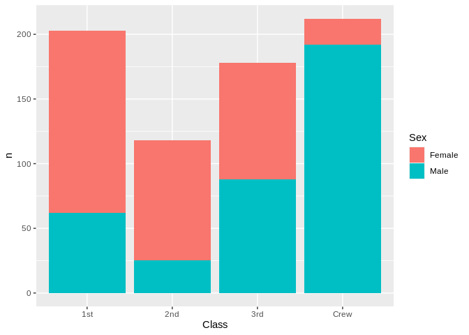
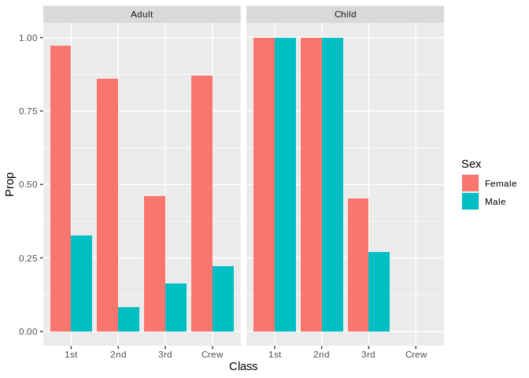

RMS Titanic
================
(Your name here)
2020-

  - [Grading Rubric](#grading-rubric)
      - [Individual](#individual)
      - [Team](#team)
      - [Due Date](#due-date)
  - [First Look](#first-look)
  - [Deeper Look](#deeper-look)
  - [Notes](#notes)

*Purpose*: Most datasets have at least a few variables. Part of our task
in analyzing a dataset is to understand trends as they vary across these
different variables. Unless we’re careful and thorough, we can easily
miss these patterns. In this challenge you’ll analyze a dataset with a
small number of categorical variables and try to find differences among
the groups.

*Reading*: (Optional) [Wikipedia
article](https://en.wikipedia.org/wiki/RMS_Titanic) on the RMS Titanic.

<!-- include-rubric -->

# Grading Rubric

<!-- -------------------------------------------------- -->

Unlike exercises, **challenges will be graded**. The following rubrics
define how you will be graded, both on an individual and team basis.

## Individual

<!-- ------------------------- -->

| Category    | Unsatisfactory                                                                   | Satisfactory                                                               |
| ----------- | -------------------------------------------------------------------------------- | -------------------------------------------------------------------------- |
| Effort      | Some task **q**’s left unattempted                                               | All task **q**’s attempted                                                 |
| Observed    | Did not document observations                                                    | Documented observations based on analysis                                  |
| Supported   | Some observations not supported by analysis                                      | All observations supported by analysis (table, graph, etc.)                |
| Code Styled | Violations of the [style guide](https://style.tidyverse.org/) hinder readability | Code sufficiently close to the [style guide](https://style.tidyverse.org/) |

## Team

<!-- ------------------------- -->

| Category   | Unsatisfactory                                                                                   | Satisfactory                                       |
| ---------- | ------------------------------------------------------------------------------------------------ | -------------------------------------------------- |
| Documented | No team contributions to Wiki                                                                    | Team contributed to Wiki                           |
| Referenced | No team references in Wiki                                                                       | At least one reference in Wiki to member report(s) |
| Relevant   | References unrelated to assertion, or difficult to find related analysis based on reference text | Reference text clearly points to relevant analysis |

## Due Date

<!-- ------------------------- -->

All the deliverables stated in the rubrics above are due on the day of
the class discussion of that exercise. See the
[Syllabus](https://docs.google.com/document/d/1jJTh2DH8nVJd2eyMMoyNGroReo0BKcJrz1eONi3rPSc/edit?usp=sharing)
for more information.

``` r
library(tidyverse)
```

    ## ── Attaching packages ─────────────────────────────────────────────────────────────────────────────────────────────────────────────────────────── tidyverse 1.3.0 ──

    ## ✓ ggplot2 3.3.2     ✓ purrr   0.3.4
    ## ✓ tibble  3.0.2     ✓ dplyr   1.0.0
    ## ✓ tidyr   1.1.0     ✓ stringr 1.4.0
    ## ✓ readr   1.3.1     ✓ forcats 0.5.0

    ## ── Conflicts ────────────────────────────────────────────────────────────────────────────────────────────────────────────────────────────── tidyverse_conflicts() ──
    ## x dplyr::filter() masks stats::filter()
    ## x dplyr::lag()    masks stats::lag()

``` r
df_titanic <- as_tibble(Titanic)
```

*Background*: The RMS Titanic sank on its maiden voyage in 1912; about
67% of its passengers died.

# First Look

<!-- -------------------------------------------------- -->

**q1** Perform a glimpse of `df_titanic`. What variables are in this
dataset?

``` r
glimpse(df_titanic)
```

    ## Rows: 32
    ## Columns: 5
    ## $ Class    <chr> "1st", "2nd", "3rd", "Crew", "1st", "2nd", "3rd", "Crew", "1…
    ## $ Sex      <chr> "Male", "Male", "Male", "Male", "Female", "Female", "Female"…
    ## $ Age      <chr> "Child", "Child", "Child", "Child", "Child", "Child", "Child…
    ## $ Survived <chr> "No", "No", "No", "No", "No", "No", "No", "No", "No", "No", …
    ## $ n        <dbl> 0, 0, 35, 0, 0, 0, 17, 0, 118, 154, 387, 670, 4, 13, 89, 3, …

**Observations**:

  - This appears to be a set of categories, as opposed to a row for each
    passenger. For example “1st class male child who died” appears to
    have an n of 0, whereas “3rd class male child who died” has an n of
    35
  - There’s a dominant group with 670 people, the next biggest is 387
    and beyond that they’re all less than 200

**q2** Skim the [Wikipedia
article](https://en.wikipedia.org/wiki/RMS_Titanic) on the RMS Titanic,
and look for a total count of passengers. Compare against the total
computed below. Are there any differences? Are those differences large
or small? What might account for those differences?

``` r
## NOTE: No need to edit! We'll cover how to
## do this calculation in a later exercise.
df_titanic %>% summarize(total = sum(n))
```

    ## # A tibble: 1 x 1
    ##   total
    ##   <dbl>
    ## 1  2201

**Observations**:

  - “Titanic’s passengers numbered approximately 1,317”
  - “Titanic had around 885 crew members on board for her maiden voyage”
  - 1,317 + 885 = 2202, which is 1 off from the dataset’s value of 2201
  - With such a small difference there could be a large number of
    trivial reasons. Perhaps reports were unclear and wikipedia chose to
    include while the dataset chose to exclude. Perhaps somebody served
    as crew and as a passenger at different points. Perhaps there was
    partially missing information on one person, enough to exclude them
    from the set. Perhaps someone died before the crash.

**q3** Create a plot showing the count of passengers who *did* survive,
along with aesthetics for `Class` and `Sex`. Document your observations
below.

*Note*: There are many ways to do this.

``` r
df_titanic %>%
    filter(Survived == "Yes") %>%
    ggplot() +
    geom_col(aes(x = Class, y = n, fill = Sex))
```

<!-- -->

**Observations**:

  - Approximately the same number of 1st class and crew survived, with a
    slightly lower number of 3rd class survivors and a much lower
    (\~50%) number of 2nd class survivors.
  - A higher number of female 1st and 2nd class passengers survived,
    with an even split in 3rd class. Many more male crew members
    survived than female.
  - This raises a huge number of questions about proportions and base
    rates, not just the survival numbers. I suspect that 1st class
    passengers made up a much smaller proportion of the people than 2nd
    or 3rd class, implying they survived at a higher rate. I suspect
    there were also many fewer female crew members in general, so the
    male-heavy split could just reflect that base rate.
  - The fact that \~200 crew survived out of 885 is upsetting, as they
    were presumably the best trained and prepared of the people on
    board.

# Deeper Look

<!-- -------------------------------------------------- -->

Raw counts give us a sense of totals, but they are not as useful for
understanding differences between groups. This is because the
differences we see in counts could be due to either the relative size of
the group OR differences in outcomes for those groups. To make
comparisons between groups, we should also consider *proportions*.\[1\]

The following code computes proportions within each `Class, Sex, Age`
group.

``` r
## NOTE: No need to edit! We'll cover how to
## do this calculation in a later exercise.
df_prop <-
  df_titanic %>%
  group_by(Class, Sex, Age) %>%
  mutate(
    Total = sum(n),
    Prop = n / Total
  ) %>%
  ungroup()
df_prop
```

    ## # A tibble: 32 x 7
    ##    Class Sex    Age   Survived     n Total    Prop
    ##    <chr> <chr>  <chr> <chr>    <dbl> <dbl>   <dbl>
    ##  1 1st   Male   Child No           0     5   0    
    ##  2 2nd   Male   Child No           0    11   0    
    ##  3 3rd   Male   Child No          35    48   0.729
    ##  4 Crew  Male   Child No           0     0 NaN    
    ##  5 1st   Female Child No           0     1   0    
    ##  6 2nd   Female Child No           0    13   0    
    ##  7 3rd   Female Child No          17    31   0.548
    ##  8 Crew  Female Child No           0     0 NaN    
    ##  9 1st   Male   Adult No         118   175   0.674
    ## 10 2nd   Male   Adult No         154   168   0.917
    ## # … with 22 more rows

**q4** Replicate your visual from q3, but display `Prop` in place of
`n`. Document your observations, and note any new/different observations
you make in comparison with q3.

``` r
df_prop %>%
    filter(Survived == "Yes") %>%
    ggplot() +
    geom_col(aes(x = Class, y = Prop, fill = Sex), position = "dodge")
```

    ## Warning: Removed 2 rows containing missing values (geom_col).

<!-- -->

**Observations**:

  - This is not super useful, the children’s statistics (1/1 survived in
    1st class, 5/5 in 2nd) appear to be overriding the columns. Instead
    of figuring out how to properly treat the ages as one group, I find
    what’s asked in q5 to be a better representation.

**q5** Create a plot showing the group-proportion of passengers who
*did* survive, along with aesthetics for `Class`, `Sex`, *and* `Age`.
Document your observations below.

*Hint*: Don’t forget that you can use `facet_grid` to help consider
additional variables\!

This is just a preparatory graph, to show the underlying demographics.
These are how many people who died (top row) and survived (bottom row)
in each combination. You can see the low number of 1st/2nd class
children make those categories less meaningful.

``` r
df_prop %>%
    ggplot() +
    geom_col(aes(x = Class, y = n, fill = Sex)) +
    facet_grid(Survived ~ Age)
```

<!-- -->

``` r
df_prop %>%
    filter(Survived == "Yes") %>%
    ggplot() +
    geom_col(aes(x = Class, y = Prop, fill = Sex), position = "dodge") +
    facet_wrap(~ Age)
```

    ## Warning: Removed 2 rows containing missing values (geom_col).

<!-- -->

**Observations**:

  - We can see that women always survived at a higher rate, if the
    1st/2nd class children are left out. The 3rd class children have the
    lowest different, with women surviving at a \~40% higher rate. 2nd
    class looks like the highest different, surviving at 8-9 times the
    rate.
  - 3rd class and crew are predominantly male, because women survive at
    higher rates but that doesn’t show as clearly in the raw numbers of
    people surviving.
  - 3rd class survival rates are average for adult men but significantly
    lower for all other 3rd class passengers.

# Notes

<!-- -------------------------------------------------- -->

\[1\] This is basically the same idea as [Dimensional
Analysis](https://en.wikipedia.org/wiki/Dimensional_analysis); computing
proportions is akin to non-dimensionalizing a quantity.
