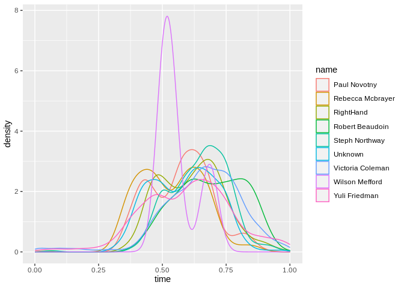

Github Usage
================
(Your name here)
2020-

``` r
# Libraries
library(chron)
library(tidyverse)
```

``` r
# Right now this appears to take a vector and only process the first element.
# What we'd want is a vector -> vector process. Working around this for now.
group_names <- function(name) {
  if (name < "J") {
    return("A")
  } else if (name < "O") {
    return("B")
  } else {
    return("C")
  }
}
```

``` r
commit_history_parsed <- read.csv("~/Desktop/commit_history_parsed.csv") %>%
  mutate(
    date = as.Date(raw_date),
    time = chron(times = raw_time),
    len_message = str_length(message),
  ) %>%
  group_by(name) %>%
  mutate(
    group = group_names(name),
  ) %>%
  ungroup
commit_history_parsed %>% glimpse
```

    ## Rows: 44,652
    ## Columns: 9
    ## $ raw_date    <chr> "2020-07-22", "2020-07-22", "2020-07-21", "2020-07-21", "…
    ## $ raw_time    <chr> "14:11:28", "14:07:10", "15:27:53", "13:24:33", "13:24:20…
    ## $ commit      <chr> "a5de7d3", "499cce8", "210549a", "4c962cd", "ebf8a12", "e…
    ## $ name        <chr> "Eric Schneider", "Eric Schneider", "Eric Schneider", "Er…
    ## $ message     <chr> "edit-comments-per-pr", "switch-order-of-transitions-per-…
    ## $ date        <date> 2020-07-22, 2020-07-22, 2020-07-21, 2020-07-21, 2020-07-…
    ## $ time        <times> 14:11:28, 14:07:10, 15:27:53, 13:24:33, 13:24:20, 16:41…
    ## $ len_message <int> 20, 34, 28, 111, 27, 18, 21, 77, 14, 23, 41, 45, 37, 14, …
    ## $ group       <chr> "A", "A", "A", "A", "A", "A", "A", "B", "A", "A", "B", "B…

``` r
summary <- commit_history_parsed %>%
  group_by(name) %>%
  summarise(n = n()) %>%
  arrange(desc(n))
summary
```

    ## # A tibble: 34 x 2
    ##    name                 n
    ##    <chr>            <int>
    ##  1 Eric Schneider    6434
    ##  2 Lael Odhner       4686
    ##  3 Andrew Clough     4503
    ##  4 Jose Gomez        2780
    ##  5 Mark Eichin       2659
    ##  6 Victoria Coleman  2628
    ##  7 Barbara Hendrick  2625
    ##  8 John Sullivan     1707
    ##  9 Matt Browne       1550
    ## 10 Mark Keck         1480
    ## # … with 24 more rows

``` r
summary %>%
  ggplot +
  geom_col(aes(x = reorder(name, -n), y = n)) +
  theme(axis.text.x = element_text(angle = 90, hjust = 1, vjust = 0.5))
```

<!-- -->

``` r
frequency_history <- commit_history_parsed %>%
  group_by(name, date) %>%
  summarize(commits_in_day = n()) %>%
  ungroup
frequency_history
```

    ## # A tibble: 10,654 x 3
    ##    name        date       commits_in_day
    ##    <chr>       <date>              <int>
    ##  1 Alyssa Gang 2018-03-23              2
    ##  2 Alyssa Gang 2018-03-28              1
    ##  3 Alyssa Gang 2018-04-04              2
    ##  4 Alyssa Gang 2018-04-11              3
    ##  5 Alyssa Gang 2018-04-13              2
    ##  6 Alyssa Gang 2018-04-18              2
    ##  7 Alyssa Gang 2018-04-19              2
    ##  8 Alyssa Gang 2018-04-20              2
    ##  9 Alyssa Gang 2018-04-24              1
    ## 10 Alyssa Gang 2018-04-25              1
    ## # … with 10,644 more rows

``` r
frequency_history %>%
  ggplot +
  geom_smooth(aes(x = date, y = commits_in_day, color = name), se=F)
```

<!-- -->

``` r
commit_history_parsed %>%
  ggplot +
  geom_smooth(aes(x = date, y = len_message))
```

<!-- -->

``` r
commit_history_parsed %>%
  ggplot +
  geom_smooth(aes(x = time, y = len_message))
```

<!-- -->

``` r
commit_history_parsed %>%
  ggplot +
  geom_density(aes(x = time))
```

<!-- -->

``` r
commit_history_parsed %>%
  ggplot +
  geom_line(aes(x = date, y = len_message)) +
  facet_wrap(~ name)
```

<!-- -->

``` r
commit_history_parsed %>%
  ggplot +
  geom_line(aes(x = time, y = len_message)) +
  facet_wrap(~ name)
```

<!-- -->

``` r
commit_history_parsed %>%
  filter(group == "A") %>%
  ggplot +
  geom_density(aes(x = time, color = name))
```

<!-- -->

``` r
commit_history_parsed %>%
  filter(group == "B") %>%
  ggplot +
  geom_density(aes(x = time, color = name))
```

<!-- -->

``` r
commit_history_parsed %>%
  filter(group == "C") %>%
  ggplot +
  geom_density(aes(x = time, color = name))
```

<!-- -->
