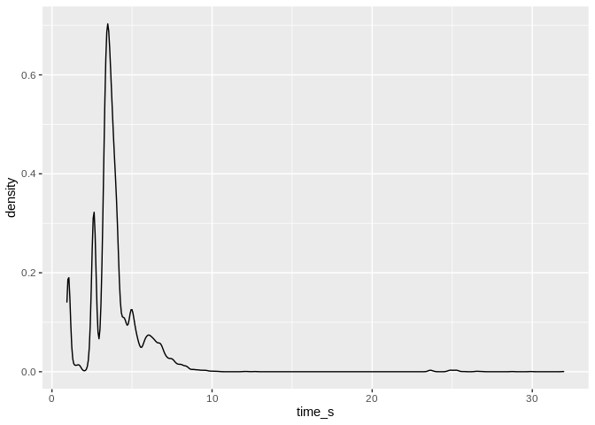
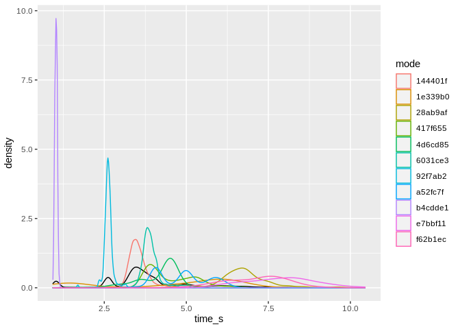
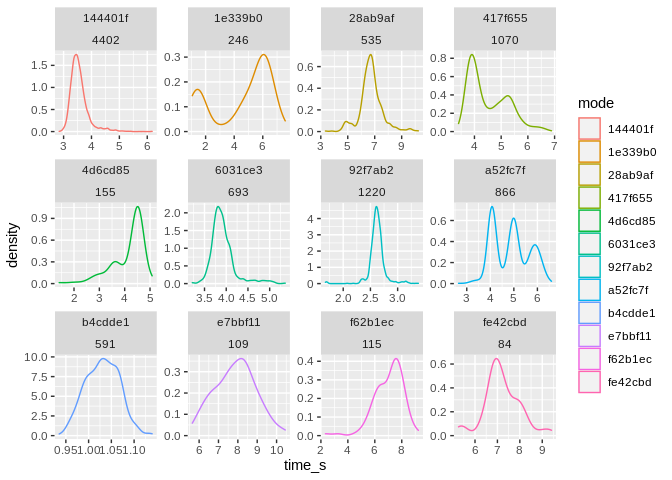

Timing Data
================
Eric
2020-08-20

``` r
# Libraries
library(tidyverse)
```

To make time\_modes.csv I took data from 3 full log files on 021 (ABBA,
\~31G each)

``` r
timing <- read.csv("~/Desktop/time_modes.csv") %>%
  group_by(mode) %>%
  mutate(appearances = n()) %>%
  ungroup %>%
  arrange(-appearances) %>%
  mutate(rank = dense_rank(-appearances))
timing %>% glimpse
```

    ## Rows: 10,338
    ## Columns: 4
    ## $ mode        <chr> "144401f", "144401f", "144401f", "144401f", "144401f", "1…
    ## $ time_s      <dbl> 3.717100, 3.588189, 3.438864, 3.451693, 3.532354, 3.55192…
    ## $ appearances <int> 4402, 4402, 4402, 4402, 4402, 4402, 4402, 4402, 4402, 440…
    ## $ rank        <int> 1, 1, 1, 1, 1, 1, 1, 1, 1, 1, 1, 1, 1, 1, 1, 1, 1, 1, 1, …

Here is what the mixture density looks like, very multi-modal.

``` r
timing %>%
  ggplot +
  geom_density(aes(x = time_s))
```

<!-- -->

Here are modes with over 100 observations, you can see how spread they
are as well as how a few overlap. Remember that since densities
integrate to 1 the height just means that it’s a very narrow density, it
doesn’t indicate the number of samples.

``` r
timing %>%
  filter(appearances > 100) %>%
  ggplot +
  geom_density(aes(x = time_s)) +
  geom_density(aes(x = time_s, color = mode))
```

<!-- -->

Here we can see the shape of the density for the top 12 modes (note that
X and Y scales are both free in order to better view the shape). I would
say 9/12 are approximately normal.

``` r
timing %>%
  filter(rank <= 12) %>%
  ggplot +
  geom_density(aes(x = time_s, color = mode)) +
  facet_wrap(~ mode + appearances, scales = "free")
```

<!-- -->
